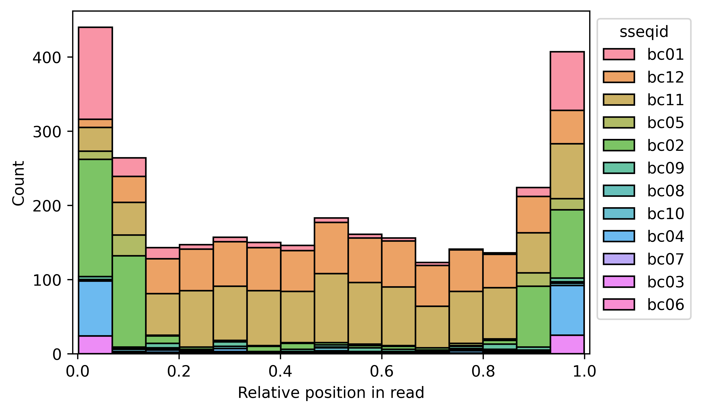
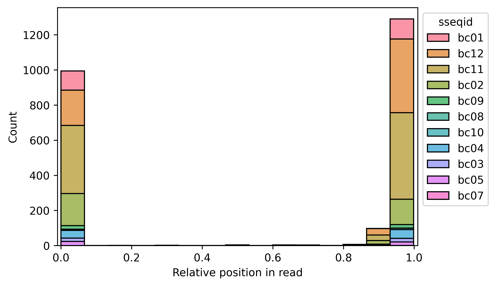

# HTbfRs2
"Hacked together but funcitonal read splitter" - A script to split highly concatenated reads from oxford nanopore sequencing.

This script is an updated version of [splitReads.py](https://github.com/HaydenRJones/splitReads). It works in much the same way -- identifying barcode regions from the [PCR barcoding kits](https://nanoporetech.com/document/chemistry-technical-document#barcode-sequences) using blastn, and spliting reads based on the number and position of hits.

## Dependencies
- [SeqKit](https://bioinf.shenwei.me/seqkit/)
- [BLAST+ executables](https://blast.ncbi.nlm.nih.gov/doc/blast-help/downloadblastdata.html)
  - blastn
  - makeblastdb[^1]
- Python >= 3.11
  - Pandas
  - Numpy
  - Biopython
  - Matplotlib[^2]
  - Seaborn[^2]

[^1]: only needed if using different barcodes from those in [EXP-PBC001](https://store.nanoporetech.com/pcr-barcoding-expansion-1-12.html)
[^2]: if plotting barcode hit distributions

## Setup

DETAILS DETAIL DETAILS
.
.
.
DETAILS DETAIL DETAILS

## Usage
### Data prerequisites
As with the previous version of this tool, the number of reads processed at any one time is the biggest bottleneck. This tool tries to circumvent this by automatically splitting data files prior to analysis.
The optimal number of reads to split into will depend on the length of reads and computer being used, however during testing 25,000 reads (100,000 lines for fastq) was found to work well and is set as the default.

### Command line arguments

- `-s, --sample` : the fastq sample to processes

- `-o, --output` : the directory to save results to. Defaults to ./output/

- `-B, --blastn_path` : the directory to the blastn executable, if not in $PATH

- `-N, --split_number` : how many reads to split the data file into. Defaults to 25,000

- `-t, --threads` : how many threads to use. Used for blastn and the final splitting step. Default is 4.

### Output

## Examples

### small_example.fastq: ###
### Read stats comparison ###
|  |Before |After |
|-----|-----|-----|
|num_seqs|1,000|2,382|
|min_len|86|8|
|max_len|28,913|15,199|
|avg_len|2,537|712|

### Relative distributions of barcode hits
**Before:**

**After:**

